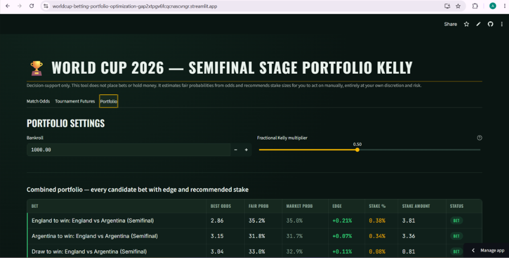
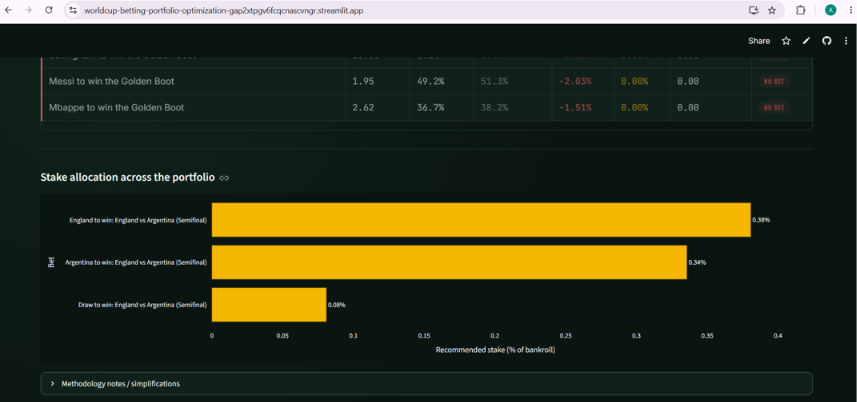
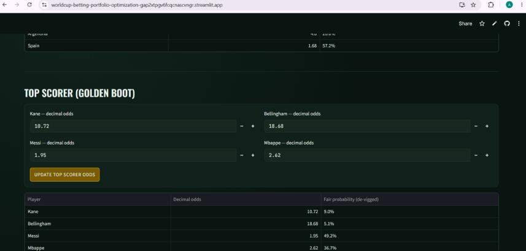

# WorldCup 2026 Betting Portfolio Optimizer: A Portfolio Approach to Sports Betting Risk

A decision-support tool for the last three matches of the World Cup
(France vs Spain, England vs Argentina, then the Final), plus the
tournament-winner and Golden Boot futures markets. It does not place
bets or hold money — it turns odds into fair probabilities and turns
those into stake-size recommendations for you to act on manually.

This app was deployed and live during the tournament's semifinal
stage, serving real-time stake recommendations to users based on
live odds.

## Screenshots







## APIs used

**[The Odds API](https://the-odds-api.com/)** — the sole external data
source, used to fetch live match-level odds (h2h moneyline and
totals) for the three remaining fixtures:

```
https://api.the-odds-api.com/v4/sports
```

Specifically, the app calls the `/sports/{sport}/odds` endpoint with
`sport_key=soccer_fifa_world_cup`, `markets=h2h,totals`, and
`regions=eu,uk`, filtering the response down to genuine back prices
(the `h2h` market key) and discarding `h2h_lay` entries, which
represent the exchange lay/back-against side rather than a price you
can actually bet at. Requests are cached for one hour
(`@st.cache_data(ttl=3600)`) and mirrored to a local JSON snapshot so
the app keeps serving the last-known odds if a call fails or the
API's quota is exhausted.

There is no reliable free API for the tournament-winner and Golden
Boot futures markets, so those odds are entered manually (sourced
from Polymarket) rather than fetched automatically.

## The idea

Sportsbooks and prediction markets don't quote "true" probabilities —
they quote prices with a built-in margin (the vig/overround), and
different books price the same outcome slightly differently. On top of
that, several of the bets available at this stage of the tournament
aren't independent events: France winning the tournament and France
beating Spain in the semifinal are obviously linked. Betting on both
as if they were unrelated overstates how diversified your portfolio
actually is.

So the tool does three things in sequence:
1. **Strip the vig** out of quoted odds to estimate each outcome's fair probability.
2. **Model the dependency** between related bets with a simple correlation heuristic.
3. **Size stakes** across the whole basket at once (not bet-by-bet) using a fractional, correlation-aware Kelly criterion.

## The math

### 1. De-vigging (removing bookmaker margin)

For a market with decimal odds `o_1, o_2, ..., o_n` covering all outcomes:

```
implied_i = 1 / o_i
overround = Σ implied_i        (this is > 1 — the bookmaker's edge)
fair_i    = implied_i / overround
```

Doing this per bookmaker and averaging the resulting `fair_i` across
every book quoting that market gives a **consensus fair probability**
— a more reliable estimate than trusting any single book's price.

### 2. Edge

For each bet, "edge" compares that consensus fair probability against
the **actual price you could bet at** (the best odds found across
bookmakers), not against the devigged price itself:

```
market_implied = 1 / best_available_odds
edge = fair_probability − market_implied
```

Positive edge means you believe the true probability is higher than
what the best available price implies — i.e. a bet worth considering.
Zero or negative edge → "no bet," full stop, regardless of anything
downstream.

### 3. Correlation heuristic

Bets are grouped into clusters by shared underlying team (e.g. every
bet involving "France"). For two correlated bets `i` and `j`, the
model estimates their covariance as:

```
ρ_ij   = min(MAX_CORR, MAX_CORR × √(p_i × p_j))
cov_ij = ρ_ij × √(var_i × var_j)
```

where `var_i` is the variance of a single Bernoulli bet's return:

```
var_i = p_i × (1 − p_i) × (b_i + 1)²      (b_i = odds_i − 1)
```

Golden Boot bets get an extra scale-down on `ρ_ij` since a player's
scoring form is a looser proxy for their team's run than a direct
match outcome. **This is a documented simplification** — not a real
model of the knockout bracket's conditional probability tree — but it
captures the right direction: correlated bets shouldn't each get a
full independent stake.

### 4. Portfolio Kelly

With expected return per bet `μ_i = p_i·b_i − (1−p_i)` and the
covariance matrix `Σ` from step 3, the (unconstrained) multivariate
Kelly-optimal stake vector is:

```
f = Σ⁻¹ μ
```

This is the standard mean-variance approximation to Kelly — it
collapses to the familiar single-bet formula `f* = (bp − q)/b` when
there's only one uncorrelated bet, but properly discounts stakes on
bets that move together.

From there:
- Any bet with non-positive edge is forced to zero, overriding whatever the correlation math alone would suggest.
- If the raw stakes sum to more than 100% of bankroll, everything is scaled down proportionally (a guardrail against the heuristic understating risk).
- The **fractional Kelly slider** (default 0.5) scales the whole result down further — full Kelly is famously high-variance, so half-Kelly (or lower) is the common risk-reduction convention.

## Logic / architecture

```
config.py          constants + editable defaults (fixtures, futures odds, correlation knobs)
odds_fetcher.py     cached live odds fetch + local JSON snapshot fallback
models.py           devig / Bet / covariance / Kelly optimizer — all the math above
ui_theme.py         dark "scoreboard" visual styling, no math
app.py              Streamlit tabs, wires odds + futures into models.kelly_optimize()
```

Match odds are fetched automatically (hourly cache + manual refresh
button); futures odds are entered manually since there's no reliable
free API for tournament-winner/Golden Boot markets. Both feed into the
same `Bet` objects and the same optimizer in the Portfolio tab.

## What this is not

- **Not a betting platform.** It never places bets, transmits funds, or connects to any bookmaker/exchange account.
- **Not investment or gambling advice.** All outputs are estimates from a simplified model, for you to interpret entirely at your own discretion and risk.